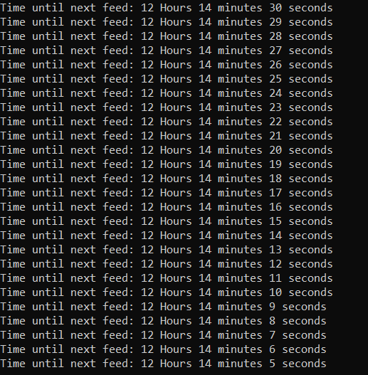
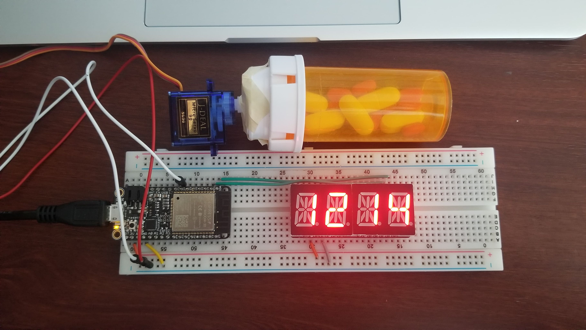

# Fish Feeder
Authors: Shineun Yoon, Briana Zhao

Date: 2020-02-19
-----

## Summary

We've created a fish feeder using an ESP32 microcontroller, an alphanumeric display, and a servo. The feeder dispenses automatically at set time intervals. This was done by using an I2C interface, timers and interrupts, and mcPWM control for servos. The timer counts down from a set time, and once it reaches 0, the servo rotates three times, thus dispensing the feed. The remaining time is displayed both on the console and the alphanumeric display.

After each time the feeder is activated, the timer is reset, and the feeding process repeats with no time lost in between.

## Self-Assessment

### Objective Criteria

| Objective Criterion | Rating | Max Value  | 
|---------------------------------------------|:-----------:|:---------:|
| Servo spins right then left three times without chatter at prescribed time intervals | 1 |  1     | 
| Alphanumeric display indicates hours and minutes.  | 1 |  1     | 
| Display shows countdown time report every second with no time loss. | 1 |  1     | 
| Food dispensed at specified times.  | 1 |  1     | 
| Demo delivered at scheduled time and report submitted in team folder with all required components | 1 |  1     | 
| NA | 1 |  1     | 
| Investigative question response. | 1 |  1     | 

### Qualitative Criteria

| Qualitative Criterion | Rating | Max Value  | 
|---------------------------------------------|:-----------:|:---------:|
| Quality of solution | 5 |  5     | 
| Quality of report.md including use of graphics | 3 |  3     | 
| Quality of code reporting | 3 |  3     | 
| Quality of video presentation | 3 |  3     | 

## Solution Design

### Variables
The code has global variables for hours, minutes, and seconds to keep track of the amount of time left until the next feeding. There is also a global variable named ‘feed_time’. This variable is set to 1 if it is time to feed, and 0 otherwise.
 
### Timer ISR handler
The timer has an interrupt every second. In the ISR, there is a flag that is set. The ISR also decrements the number of seconds left. If the ‘seconds’ variable reaches -1, then the remaining ‘minutes’ is decremented. If ‘minutes’ reaches 0, then ‘hours’ is decremented. Once ‘hours’, ‘minutes’, and ‘seconds’ all reach 0, then ‘feed_time’ is set to 1, and ‘hours’, ‘minutes’, and ‘seconds’ are reset to their initial value to prepare for the next feeding time.
 
### Timer event task
This task checks to see if the flag and ‘feed_time’ are 1. If they are, then a for-loop makes the servo rotate left and right three times. To do this, we set the maximum angle of the servo to 15. After the servo finishes its three rotations, ‘feed_time’ is set back to 0. This task also prints the remaining hours, minutes, and seconds to the console.
 
### Alphanumeric task
This task displays the remaining hours and minutes to the alphanumeric display. It separates ‘hours’ and ‘minutes’ into a most-significant and least-significant digit by first performing modulo 10 then dividing by 10. Then it uses a variable called ‘displaybuffer’ to display the appropriate digits on the alphanumeric display.
 
### Investigative Question
One option would be to use UART and ask the user to enter a time interval. The user could enter hours, minutes, and seconds, then the variables in the code would be set to those values. This would allow the user to change the time interval without having to hard code anything.
Besides, the extra components, such as buttons or sensors, could be attached to the board to change the interval. For example, the time interval will be changed depending on the number of times the user pressed the button.

## Sketches and Photos
Image of the console:

  

 

 
Image of the constructed fish feeder:

  

 

## Supporting Artifacts
- [Link to video demo](https://drive.google.com/file/d/11Vh95rC0XtomDXGerpekXkKC-cl9LjIZ/view?usp=sharing)
- [Storyboard](https://github.com/BU-EC444/TeamRockBison-Yoon-Zhao/blob/master/quest-1/images/Quest1-FishFeeder.png)
- [Link to code](https://github.com/BU-EC444/TeamRockBison-Yoon-Zhao/blob/master/quest-1/code/fishfeeder.c)

## Modules, Tools, Source Used Including Attribution

## References

[Class timer-example](https://github.com/BU-EC444/code-examples/tree/master/timer-example)
 
[Class i2c-display example](https://github.com/BU-EC444/code-examples/tree/master/i2c-display)
 
[ESP-IDF mcpwm_servo_control example](https://github.com/espressif/esp-idf/tree/master/examples/peripherals/mcpwm/mcpwm_servo_control)

-----

