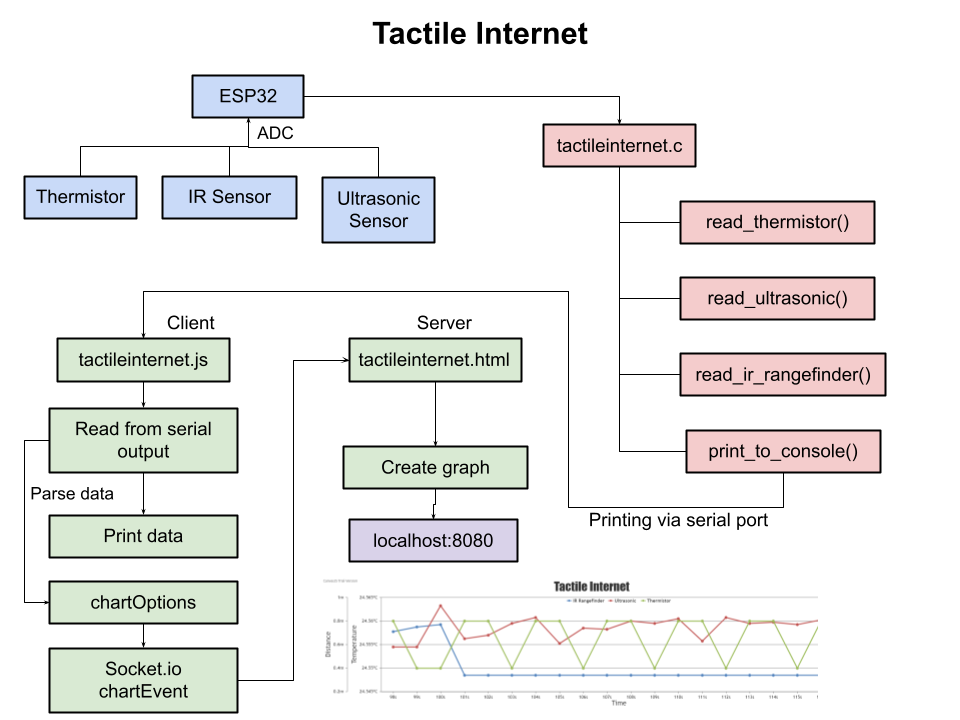
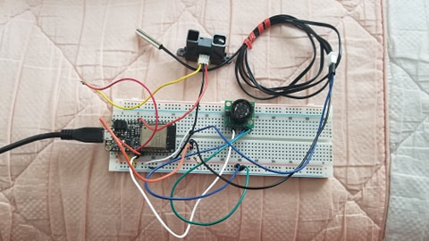
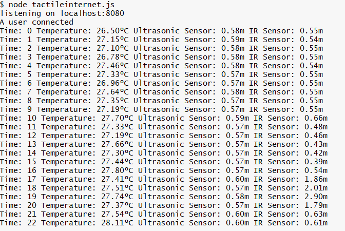
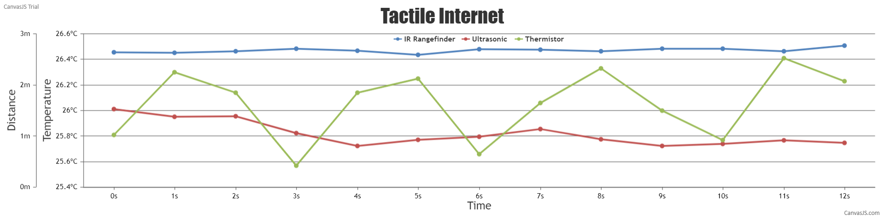

# Tactile Internet
Authors: Shineun Yoon, Briana Zhao
 
Date: 2021-03-05
-----
 
## Summary
 
For this project, we’ve built a program to create a graph with the values read from sensors connected to the ESP32 board. The board is connected to a few different analog sensors: Ultrasonic sensor, Thermistor, and IR sensor. After reading sensor values, these data have been sent to the host to print to the console and create the graph with the live data.
 
## Self-Assessment
 
### Objective Criteria
 
| Objective Criterion | Rating | Max Value  | 
|---------------------------------------------|:-----------:|:---------:|
| Periodic reporting of ultrasonic range in m | 1 |  1     | 
| Periodic reporting of IR range in m | 1 |  1     | 
| Periodic reporting of temperature in C | 1 |  1     | 
| Results displayed at host as text | 1 |  1     | 
| Results graphed at host continuously based on reporting period | 1 |  1     | 
| Demo delivered at scheduled time and report submitted in team folder with all required components | 1 |  1     | 
| Investigative question response | 1 |  1     | 
 
 
### Qualitative Criteria
 
| Qualitative Criterion | Rating | Max Value  | 
|---------------------------------------------|:-----------:|:---------:|
| Quality of solution | 5 |  5     | 
| Quality of report.md including use of graphics | 3 |  3     | 
| Quality of code reporting | 3 |  3     | 
| Quality of video presentation | 3 |  3     | 
 
 
## Solution Design
 
### Connecting to ESP32:
We connected the thermistor (in parallel with a 1 kOhm resistor), ultrasonic sensor (using analog voltage output pin), and IR range sensor to the ESP32 via three ADC pins (A2, A3, and A4). To read the values and convert them, we have a task for each sensor, and one task to print the values. The tasks for each sensor are reused from our skills (13, 14, 15). The thermistor task converts the voltage into Celsius, and the ultrasonic sensor and IR sensor tasks convert the voltage into distance in meters.
 
### Node.js:
For this we read from the serial port that the ESP32 is printing to. The program parses the data and it stores it into arrays for the thermistor, ultrasonic sensor, and IR sensor. We then used Socket.io to establish a connection between a client and a server. The client in our tactileinternet.js file details the options for our chart (data, axis titles, font size, etc.) and sends these options to the server, which is our tactileinternet.html file. The chart options get updated every second with the data, so the server is also receiving the live data from the ESP32. Our tactileinternet.js file is also printing the sensor data to the console every second.
 
### CanvasJS
We used CanvasJS to create a live graph of our sensor readings. It displays a separate line for each of the sensors (Green = Thermistor, Blue = IR Sensor, Red = Ultrasonic Sensor). This is done by receiving the chart options from the client (via Socket.io) then rendering the chart with the most recent chart options.
 
 
 
### Ultrasonic Sensor VS. Infrared (IR) Sensor
|	| Ultrasonic Sensor | Infrared (IR) Sensor |
|---------------------------------------------|:-----------:|:---------:|
| Detect Range | 1mm ~ 5m | 20cm ~ 1.5m |
| Source | Soundwaves | Light |
| Cost | + $3 | Under $1|
 
 
### Investigative question: Tabulate and compare the accuracy and speed of the IR and ultrasonic sensors. Which one would you prefer to use to support driving a robotic car?
 
From our work on the quest, we experienced that the IR sensor is faster (more responsive) than the ultrasonic sensor. This makes sense because light travels faster than sound, and the ultrasonic sensor makes use of sound waves to determine distance.
 
However, there are a lot of instances when an IR sensor might not be optimal. If the lighting is not optimal, for instance, if it is very sunny outside, it would interfere with the performance of the IR sensor in the robotic car. Additionally, if it is really rainy or foggy, the water particles could distort the light being projected from the sensor. 
 
Therefore, for a robotic car, since it is very important to consider weather conditions when driving, we would select an ultrasonic sensor for higher accuracy and reliability. Furthermore, since the ultrasonic sensor has target size compensation, it could give more accurate readings when there are targets of various sizes. However, considering that ultrasonic sensors tend to be more expensive than IR sensors, if we were on a strict budget, then we might select an IR sensor. 
 
 
## Sketches and Photos

Here is a diagram that demonstrates our solution:
 

  

 

Here is a photo of the sensors connected to the ESP32:
 

  

 

 
Here is a photo of the sensor readings printed to the console:
 

  

 

 
Here is a photo of the sensor readings being graphed live:
 

  

 

 
 
## Supporting Artifacts
- [Link to video demo](https://drive.google.com/file/d/1AXDRX6QG4bXT_4tR9oa7x0ckw4-AfFWL/view?usp=sharing)
- [Storyboard](https://github.com/BU-EC444/TeamRockBison-Yoon-Zhao/blob/master/quest-2/images/Quest2-TactileInternet.png)

- [tactileinternet.c code](https://github.com/BU-EC444/TeamRockBison-Yoon-Zhao/blob/master/quest-2/code/tactileinternet.c)
- [tactileinternet.js code](https://github.com/BU-EC444/TeamRockBison-Yoon-Zhao/blob/master/quest-2/code/tactileinternet.js)
- [tactileinternet.html code](https://github.com/BU-EC444/TeamRockBison-Yoon-Zhao/blob/master/quest-2/code/tactileinternet.html)
 
## Modules, Tools, Source Used Including Attribution
 
## References
 
We used the following resources to help graph the sensor readings live:
 
https://k6.io/docs/javascript-api/k6-ws/socket/socket-setinterval-callback-interval

https://www.tutorialspoint.com/socket.io/

https://canvasjs.com/html5-javascript-dynamic-chart/
 
We used the provided ADC example:
 
https://github.com/espressif/esp-idf/tree/39f090a4f1dee4e325f8109d880bf3627034d839/examples/peripherals/adc
 
-----
 
 

