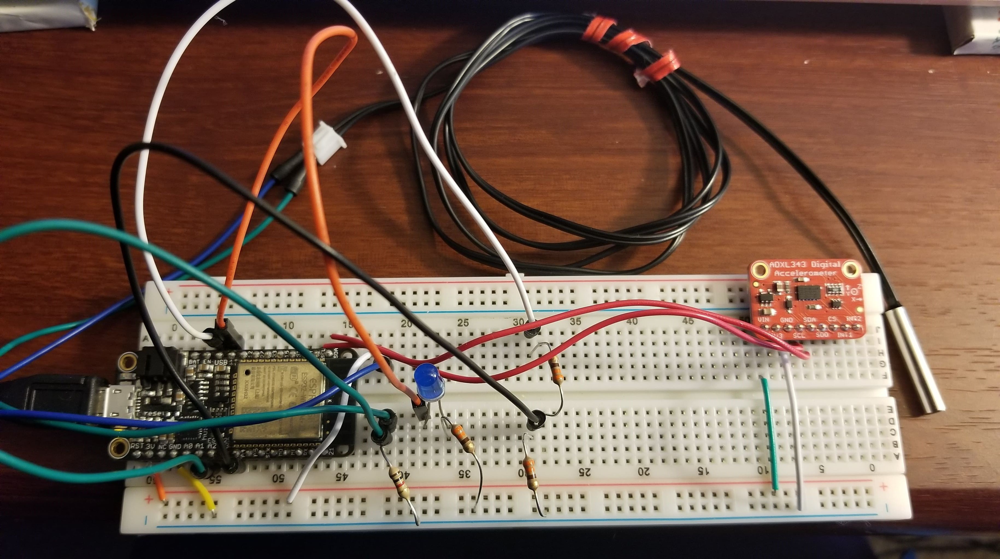
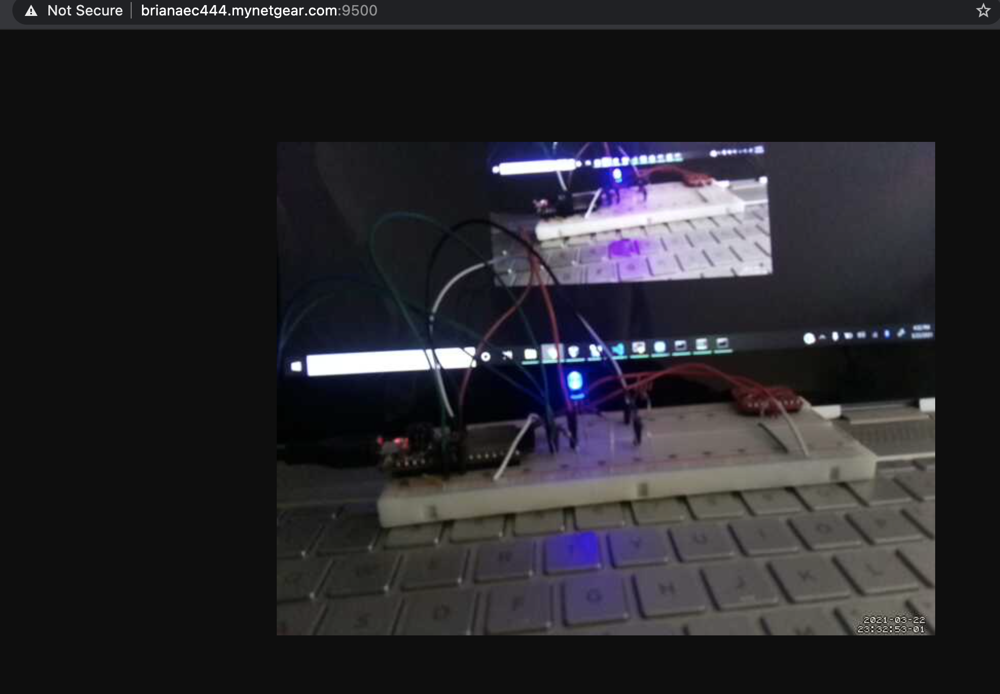
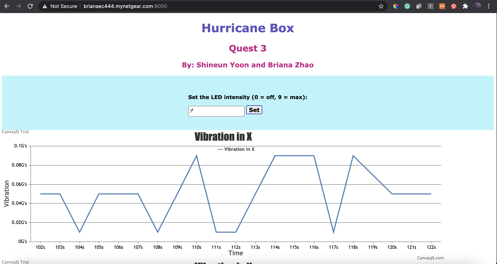
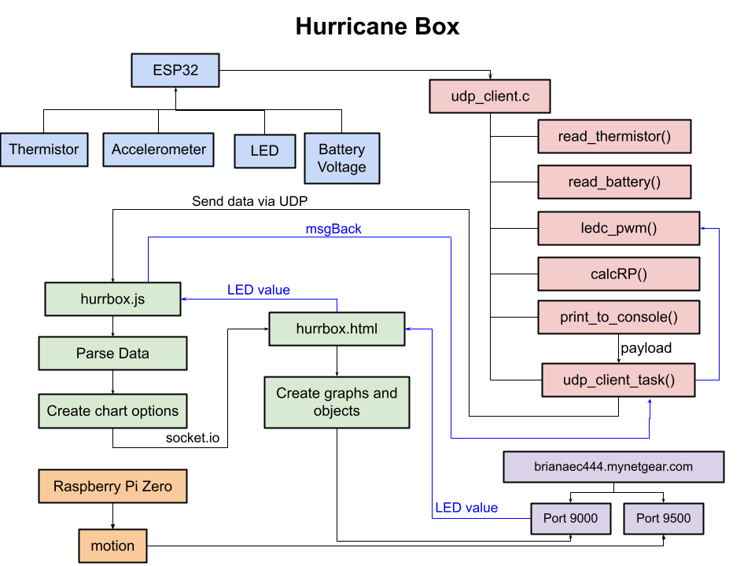

# Hurricane Box
Authors: Shineun Yoon, Briana Zhao
 
Date: 2021-03-23
-----
 
## Summary
 
For this project, we’ve built a ‘Hurricane Box’ that records data from the attached sensors and displays them on a portal. The data, such as temperature, acceleration, and battery level, is measured with ESP32 sensors. Those values are sent to remote servers over WiFi and UDP. In addition, a webcam, attached to the Raspberry Pi, sources video into the website. From the portal, we also provide the option to control the intensity of LED on the board remotely. Both websites (one for live sensor readings/controlling the LED and one for the webcam stream) can be accessed through ports through DDNS.
 
## Self-Assessment
 
### Objective Criteria
 
| Objective Criterion | Rating | Max Value  | 
|---------------------------------------------|:-----------:|:---------:|
| Measures acceleration, temperature, and battery level | 1 |  1     | 
| Displays real-time data (temperature, vibration, battery level) at remote client via portal using separate IP network. | 1 |  1     | 
| Controls LED on box from remote client via portal. | 1 |  1     | 
| Sources web cam video into remote client. | 1 |  1     | 
| ESP32 and Rpi are connected wirelessly to (or as) router; ESP32 sensor data are delivered to local node server (on local laptop or Rpi) | 1 |  1     | 
| Demo delivered at scheduled time and report submitted in team folder with all required components | 1 |  1     | 
| Investigative question response | 1 |  1     | 
 
 
### Qualitative Criteria
 
| Qualitative Criterion | Rating | Max Value  | 
|---------------------------------------------|:-----------:|:---------:|
| Quality of solution | 5 |  5     | 
| Quality of report.md including use of graphics | 3 |  3     | 
| Quality of code reporting | 3 |  3     | 
| Quality of video presentation | 3 |  3     | 
 
 
## Solution Design
 
### Connecting Peripherals to ESP32

We connected an accelerometer, thermistor, LED, and voltage divider to the ESP32 to be able to read acceleration, temperature, and battery level. We reused code from our previous skills to read in the values from each sensor and convert them to engineering units. To convert acceleration into vibration, we first read in 10 values from the accelerometer and averaged them to determine the steady state in the x, y, and z direction. Subsequent values are then compared to the steady state to determine the vibration.
 
The sensor values are then sent via UDP to the server (Node.js file) every second. A value is also received from the UDP server to set the intensity of the LED.
 
### Configuration of Remote Access (DDNS)
We used No-IP to create a free DDNS account, and we used the DDNS link brianaec444.mynetgear.com to access the web servers. The link brianaec444.mynetgear.com:9000 will display our sensor readings and allow the user to control the LED remotely. The link brianaec444.mynetgear.com:9500 allows the user to view the streamed video from the Raspberry Pi Zero.
 
### Data Transfer
 
We used UDP protocol and set up the ESP32 as the UDP client and Node.js as the UDP server. The ESP32 sends the sensor values every second via UDP to Node.js. Node.js then parses the data, creates the chart information, then sends this information to the hurrbox.html file via socket.io.
 
Information from the web server (used for controlling the LED) is sent from hurrbox.html to the hurrbox.js file via socket.io, then hurrbox.js sends the information back to the ESP32 via UDP. The ESP32 is then able to set the intensity of the LED.
 
### Investigative question: What are steps you can take to make your device and system low power?
 
One of the simplest ways to reduce power consumption on the Raspberry Pi would be to disable the features that are not critical for performance. For example, we could turn off the bluetooth feature since we are not exploiting it. 
 
Another way to make the system low power is to allow the user to deactivate sensors when their readings are not needed. For example, if the user does not need the vibration readings, there could be a button on the web server that tells the ESP32 to stop reading from the accelerometer. This way, the accelerometer is not continuously reading in a while loop. 
 
Yet another way to reduce power consumption would be to read the sensor values at larger intervals. This way, new data values do not need to be sent every single second. If circumstances allow, the user might be satisfied with receiving readings every 30 seconds (or longer). For instance, if you are in an environment where temperature is not fluctuating, then you probably don’t need to know the updated temperature every second. This way, new data does not need to be sent over UDP as frequently.
 
 
## Sketches and Photos
Photo of our circuit:
 

 
Photo of Webcam Sourcing Video:
 

 
Photo of Client Portal:
 

 
Diagram of technical details:
 

 
## Supporting Artifacts
- [Link to video demo](https://drive.google.com/file/d/1D3yO-Fyfw7wASu5hIwuUfdlurzBWcmdR/view?usp=sharing)
 
- [Link to Storyboard](https://github.com/BU-EC444/TeamRockBison-Yoon-Zhao/blob/master/quest-3/images/Quest3-HurricaneBox.jpg)

- [Link to udp_client.c code](https://github.com/BU-EC444/TeamRockBison-Yoon-Zhao/blob/master/quest-3/code/udp_client.c)

- [Link to hurrbox.js code](https://github.com/BU-EC444/TeamRockBison-Yoon-Zhao/blob/master/quest-3/code/hurrbox.js)

- [Link to hurrbox.html code](https://github.com/BU-EC444/TeamRockBison-Yoon-Zhao/blob/master/quest-3/code/hurrbox.html)
 
## Modules, Tools, Source Used Including Attribution
 
## References
 
- [Resource for formatting web page](https://www.w3schools.com/howto/howto_css_center_button.asp)
- [ESP UDP Client example](https://github.com/espressif/esp-idf/tree/master/examples/protocols/sockets/udp_client)
- [Class site for setting up UDP server](http://whizzer.bu.edu/briefs/design-patterns/dp-sockets)
 
- For low power consumption (investigative question):

http://iot-bits.com/ultra-low-power-design-esp32-10-tips/

https://www.raspberrypi.org/forums/viewtopic.php?t=152692

https://learn.pi-supply.com/make/how-to-save-power-on-your-raspberry-pi/

