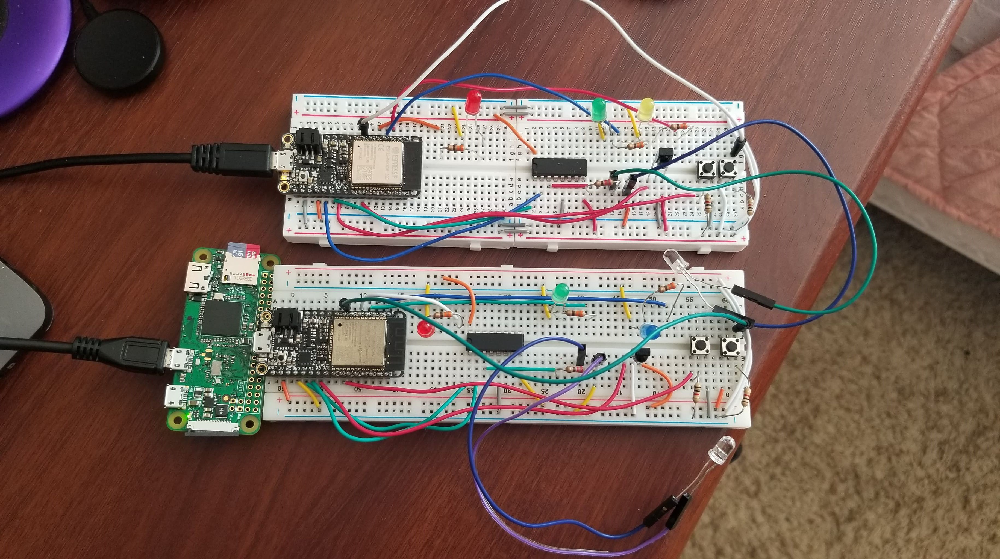
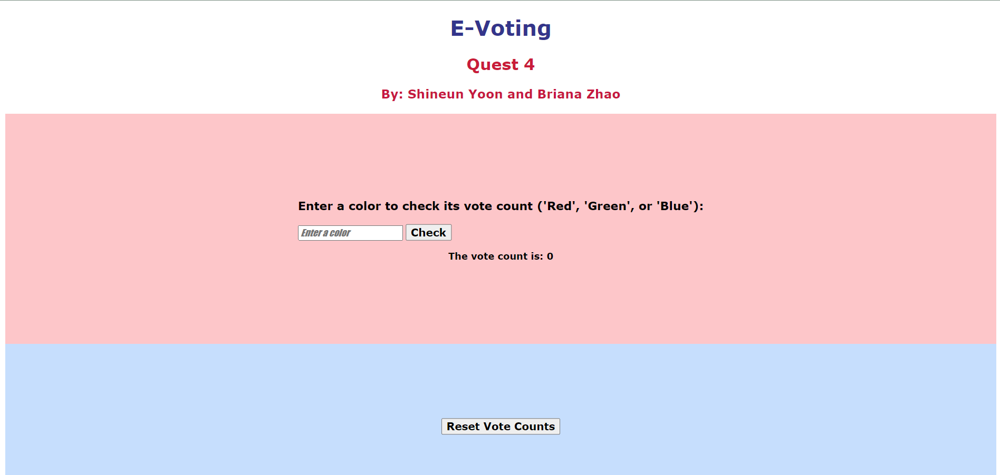
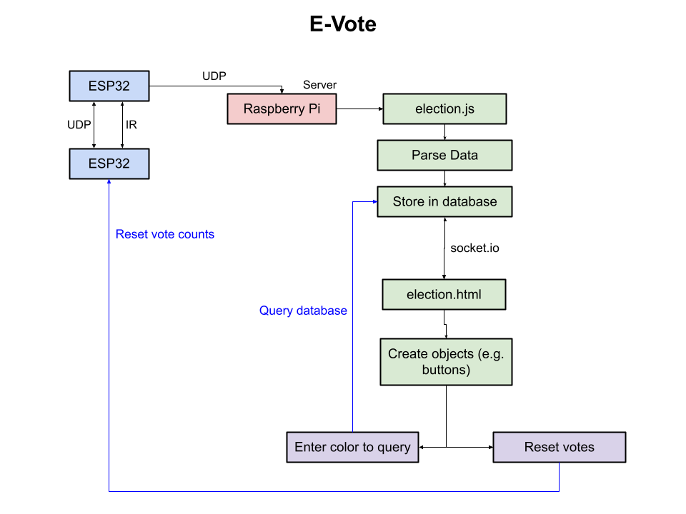

# E-Voting
Authors: Shineun Yoon, Briana Zhao
 
Date: 2021-04-08
-----
 
## Summary
 
For this project, we implemented an ‘E-Voting (Electronic Voting)’ system that allows fobs to vote between ‘Red’, ‘Green’, and ‘Blue’. The devices communicate via IR as well as UDP. A poll leader also reports the vote to a server, which stores the data in a database. A web portal allows a user to query the database for the current number of votes for a candidate, and it also allows the user to press a button to reset the vote count. 
 
## Self-Assessment
 
### Objective Criteria
 
| Objective Criterion | Rating | Max Value  | 
|---------------------------------------------|:-----------:|:---------:|
| Fob performs IR NFC data exchange of vote to another fob (LED indication) | 1 |  1     | 
| Receiving fob communicates vote to Poll Leader (LED indication) via network communication | 1 |  1     | 
| Poll leader (LED indication) is replaced if fails | 1 |  1     | 
| Poll Leader reports votes to server database. | 1 |  1     | 
| Portal allows query to database to show actual vote counts per candidate | 1 |  1     | 
| Operates over multiple sites or with all available fobs (up to 9) | 0 |  1     | 
| Investigative question response | 1 |  1     | 
 
 
### Qualitative Criteria
 
| Qualitative Criterion | Rating | Max Value  | 
|---------------------------------------------|:-----------:|:---------:|
| Quality of solution | 5 |  5     | 
| Quality of report.md including use of graphics | 3 |  3     | 
| Quality of code reporting | 3 |  3     | 
| Quality of video presentation | 3 |  3     | 
 
 
## Solution Design
 
### IR-TX/RX
 
The fob that wishes to notify the poll leader of its vote transmits its vote through IR. The voting fob first selects a candidate by using a button, then it presses another button to transmit the vote via IR to the poll leader. The poll leader acknowledges the received vote by matching its LED to the vote it received.
 
### UDP Message Passing
 
The fobs communicate over UDP with each other to be able to detect if/when the poll leader goes offline. If the poll leader does not send a message over UDP to the other fobs for 45 seconds, then a new poll leader is chosen. The poll leader is also continuously reporting the vote count to the server over UDP. 
 
### Database Setup
 
The server receives the vote count from the poll leader via UDP, and it parses the data into vote counts for red, green and blue. We then used TingoDB to store these vote counts into a database. The database is able to be queried when the user enters a color on the web page. The result from the query is directed back to the web page to be displayed to the user.
 
### Web Page/Portal Design
 
The web portal allows the user to enter a color (‘Red’, ‘Green’, or ‘Blue’) to check how many votes that candidate has. This query is sent back to the Node.js file to query the database. The result is then sent back to the web portal and displayed to the user. There is also another button that the user can click to reset the vote counts (back to 0).
 
 
### Issues We Faced
One major obstacle we faced was establishing DDNS (or an alternative) on both of our group member’s sides in order to implement a system with more than two fobs. While we had DDNS set up properly on one side, the other group member’s WiFi/router setup was extremely restrictive and thus very difficult to set up DDNS. We tried alternatives such as portmap.io, but after trying for many hours, we unfortunately were not able to get it to work. Working remotely from separate locations on this project made it much more difficult to bring up a larger system. 
 
Another obstacle we faced was faultiness and inconsistency in the hardware. We found that the IR transmitter and receiver were very inconsistent, and it often took a very long time to figure out a positioning that would send and receive the data. We often had to reflash and rerun the code, then we had to reposition the IR diode many times for the IR transmitter to successfully pick up the information.
 
### Investigative question: List 5 different ways that you can hack the system (including influencing the vote outcome or preventing votes via a denial of service) For each above, explain how you would mitigate these issues in your system.

1. **Securing the database**: Since the web page and the server are communicating over a socket, a hacker could potentially access the server and modify the database. The server (Node.js file) is what edits and queries the database, so the hacker would do a lot of damage to the voting system. For example, they could change the values in the database so that the incorrect vote counts are being stored. To mitigate this, we could encrypt the database or use a more secure database format to protect the information stored.
 
1. **DDOS Attack**: If the server receives a large amount of data in a short period of time, it would cause the server to fail to process the consequent data. Since the web page allows the user to enter color and query the database for the number of votes it has, they could enter many colors right after one another. This would potentially crash the system because it is trying to send a large amount of data continuously. To prevent this, the web page could limit the number of times the user can enter a color during a set period of time (e.g. can only enter a color once every 5 seconds).
 
1. **Front-End Security**: A stranger could navigate to the web page and influence the vote count easily because we don’t have any form of security on the web page. They could continuously press the ‘Reset Vote Counts’ button, which will keep setting the vote counts to zero, and this would be greatly disruptive to our voting system. To mitigate this issue, we could implement username/password protection so that unwanted users cannot access the web page.  
 
1. **Man-in-the-Middle Attack**: If someone tries to intercept the communications between server and ESP32 or between leader and voters, it is possible for them to modify the vote data and falsify it. For example, since vote counts are transmitted over UDP, the hacker could sever this connection or interfere with the connection to send false data instead. To mitigate this, we could look for a more secure protocol as a way of communicating between fobs and servers. Then the communication is less vulnerable to being hacked and tampered with.	
	
1. **Malware**: Someone could hack the system by first navigating to our web page and then modifying the page’s elements by reassigning their purpose. For example, someone could change the purpose of the ‘Reset Vote Counts’ button to install malicious data or viruses onto our ESP32, Raspberry Pi, or laptop. This would greatly cripple and probably even destroy the voting system. This threat could be mitigated by adding username/password protection or two-factor authentication to our page. It could also be further prevented by using a service like Cloudflare to manage the traffic to the web page and block malicious activity.
 
 
 
## Sketches and Photos
Photo of our circuit:
 

 
Photo of our web page:
 

 
Diagram of our system:
 

 
## Supporting Artifacts
- [Link to video demo](https://drive.google.com/file/d/1sYX8XHYV8HKE3UyuunWKjPHcl5QLSMlX/view?usp=sharing)
- [Link to vote.c code](https://github.com/BU-EC444/TeamRockBison-Yoon-Zhao/blob/master/quest-4/code/vote.c)
- [Link to election.js code](https://github.com/BU-EC444/TeamRockBison-Yoon-Zhao/blob/master/quest-4/code/election.js)
- [Link to election.html code](https://github.com/BU-EC444/TeamRockBison-Yoon-Zhao/blob/master/quest-4/code/election.html)
- [Link to storyboard](https://github.com/BU-EC444/TeamRockBison-Yoon-Zhao/blob/master/quest-4/images/storyboard.png)
 
## Modules, Tools, Source Used Including Attribution
 
## References
 
- [Provided ESP32 udp client example](https://github.com/espressif/esp-idf/tree/master/examples/protocols/sockets/udp_client)
 
- [Provided ESP32 udp server example](https://github.com/espressif/esp-idf/tree/master/examples/protocols/sockets/udp_server)
 
- [Provided traffic light example](https://github.com/BU-EC444/code-examples/tree/Spring-2021/traffic-light-ir-example)
 
 

