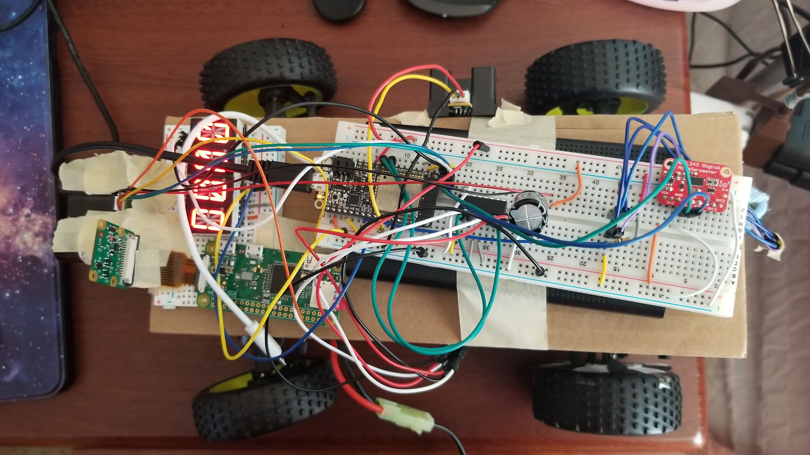
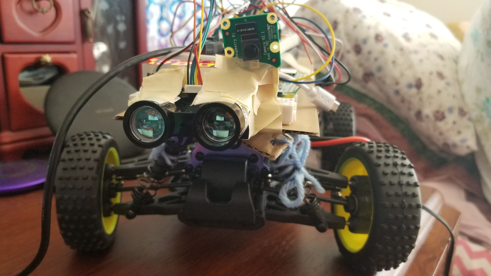
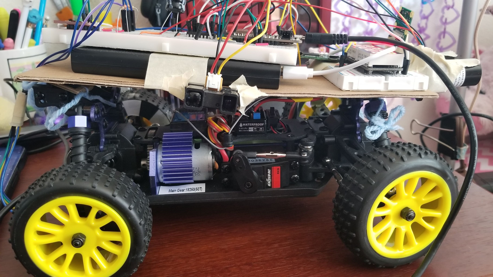
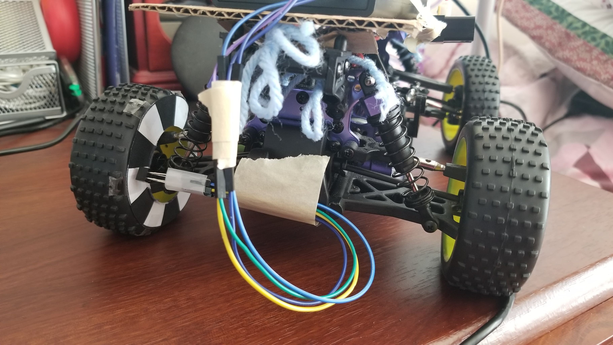
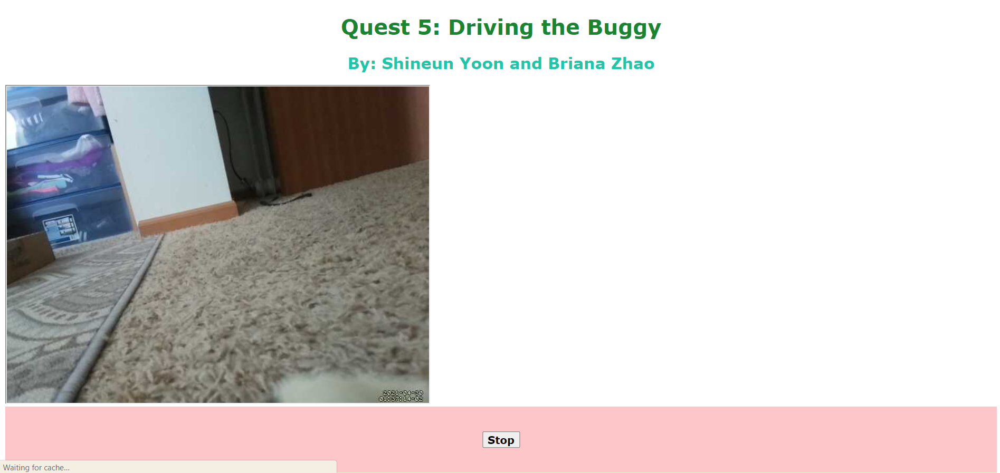
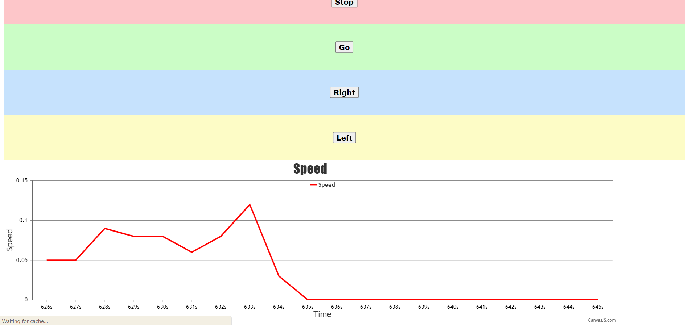
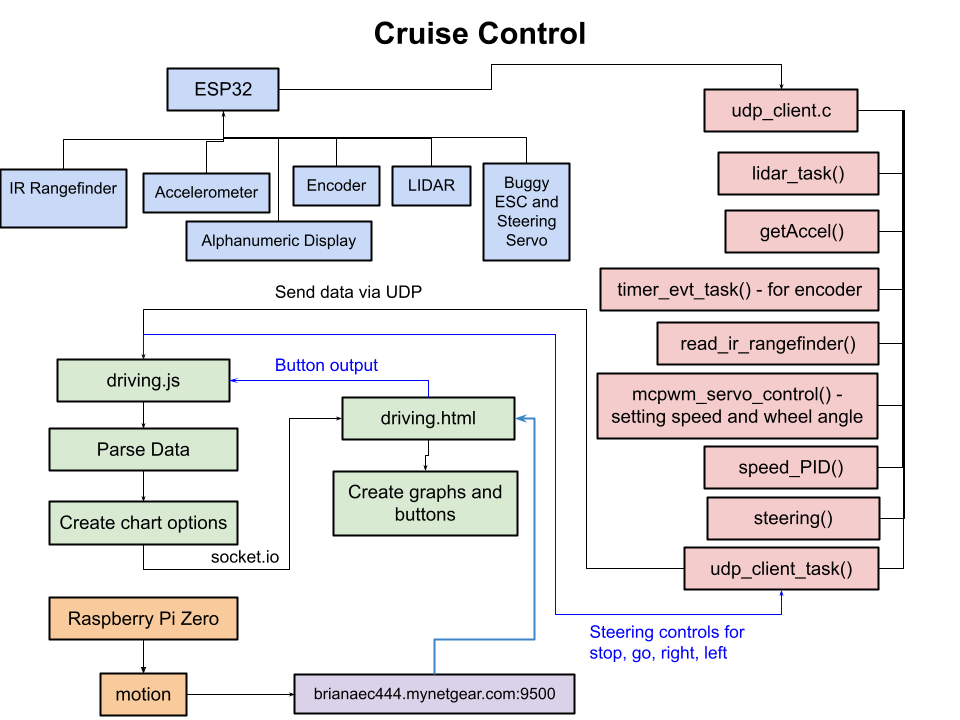

# Cruise Control
Authors: Shineun Yoon, Briana Zhao
 
Date: 2021-04-29
-----
 
## Summary
 
For this project, we have created an autonomously driving buggy that can detect obstacles and can be controlled from a web page. The buggy stops when an obstacle is encountered or when a user presses a button on a web page. The buggy can also turn left or right when a user presses the corresponding button on the web page. The buggy also determines speed with both an encoder and an accelerometer, and it uses a LIDAR and an IR rangefinder to measure distance in front and to the side of the buggy. 
 
## Self-Assessment
 
### Objective Criteria
 
| Objective Criterion | Rating | Max Value  | 
|---------------------------------------------|:-----------:|:---------:|
| Controls steering to maintain center of course +/- 25cm for entire length | 1 |  1     | 
| Uses PID for speed control holding a fixed speed setpoint after startup and before slowdown [0.1-0.4 m/s] | 1 |  1     | 
| Stops within 20 cm of end without collision | 1 |  1     | 
| Start and stop instructions issued wirelessly from phone, laptop or ESP). | 1 |  1     | 
| Measures wheel speed or distance | 1 |  1     | 
| Uses alpha display to show current distance or speed | 1 |  1     | 
| Live camera feed and IMU-based speed streamed to a node server | 1 |  1     |
| Using object detection to query for user-specified turn direction and execute turn successfully to avoid obstacle | 1 |  1     |
| Demo delivered live for the entire class on 4/29 (requires pre-signup via email, you will have 6 minutes) | 0 |  1     | 
| Investigative question response | 1 |  1     | 
 
### Qualitative Criteria
 
| Qualitative Criterion | Rating | Max Value  | 
|---------------------------------------------|:-----------:|:---------:|
| Quality of solution | 5 |  5     | 
| Quality of report.md including use of graphics | 3 |  3     | 
| Quality of code reporting | 3 |  3     | 
| Quality of video presentation | 3 |  3     | 
 
 
## Solution Design
 
### Attaching sensors and the ESP to the vehicle
For this quest we have integrated various sensors and components to read and display data: LIDAR, Accelerometer, Optical Encoder, IR Rangefinder or Ultrasonic sensor, Alphanumeric display, and Raspberry Pi. The LIDAR and IR rangefinder were used to read the distance values from the front and side of the buggy. The accelerometer was attached to the ESP32 in order to calculate the speed. Furthermore, we’ve used an optical encoder to measure the wheel speed and the total distance traveled by the buggy. The speed from the encoder was displayed on the alphanumeric display. Along with these components, the Raspberry Pi was attached to the buggy to stream live video from the webcam. The ESP32 and the Raspberry Pi were powered using a portable Powerbank/battery for mobility.
 
### Enabling control using feedback from the sensors
The Raspberry Pi streams live video to the web page to allow the user to see what the buggy sees. The LIDAR is also detecting obstacles that might appear in front of the buggy. If the LIDAR senses an obstacle, the obstacle will also appear in the live video on the web page. The user can then select ‘Stop’, ‘Go’, ‘Left’, or ‘Right’ on the web page to control the buggy.
 
### Preventing collisions by detecting objects
The buggy uses both a LIDAR and an IR rangefinder to detect obstacles and prevent collisions. The LIDAR is attached to the front of the buggy and the IR rangefinder is attached to the right side of the buggy. If the LIDAR detects an obstacle less than 65 cm away, then the buggy will stop (detecting 65 cm away gives the buggy time to stop within 20 cm of the collision). Once the obstacle is detected and the buggy stops, the user can press the ‘Left’ or ‘Right’ buttons on the web page to make the buggy turn in the same direction. If the IR rangefinder detects a wall less than 22 cm away, then the wheels steer slightly to the left, and if the IR rangefinder detects a wall greater than 78 cm away, then the wheels steer slightly to the right. This ensures that the buggy remains at the center of the track.
 
### Calculating speed and distance with optical encoder and accelerometer
We used both an optical encoder and accelerometer to calculate the speed of the buggy. For the optical encoder, we adapted our code from skill 32, which counts pulses with the help of a timer that goes off every 1 second. The speed from the optical encoder is displayed on the alphanumeric display in cm/sec. For the accelerometer, we calculated the speed in m/s by integrating the acceleration readings with respect to dt, which is just 1 second. The speed from the accelerometer is sent via UDP to the Node.js server. From there, it is graphed live via CanvasJS to our web page.
 
### Issues We Faced
It was difficult to attach everything to the buggy and make sure it remained stable. We had to carefully tape all sensors, breadboards, and components to a board on top of the buggy, and it was difficult making sure everything fit without falling off.
 
It was also difficult to get the buggy to travel at a slower speed consistently. The buggy required recalibration each time it turned off or needed to be charged, and each time the value needed to travel at a slower speed would change. We spent a lot of time trying to get the buggy to travel at an optimal speed so that we could integrate it with the speed PID.
 
### Investigative question: how would you change your solution if you were asked to provide ‘adaptive’ cruise control?
 
To allow ‘adaptive’ cruise control, we could first ask the user what speed they want the buggy to travel at. Then, using PID, we could maintain the cruising speed of the buggy at the speed the user inputed. Furthermore, instead of always stopping when an obstacle is encountered, we could adjust the buggy’s speed as needed. To achieve this, there would need to be a calculation unit that would give the system a suggested speed to maintain the distance between the leading vehicle.  This is reflective of cars in real life with cruise control; they will adapt their speed to maintain a following distance from cars in front. With these additions, the buggy would be able to cruise steadily at a speed decided by the user with a safe following distance from any obstacles that might arise.
 
 
 
 
## Sketches and Photos
Photo of the buggy from the top:
 

 
Photo of the buggy from the front:
 

 
Photo of the buggy from the right:
 

 
Photo of encoder attached to the buggy:
 

 
Photo of our web page:
 

 
Diagram of our system:
 

 
## Supporting Artifacts
- [Link to video demo](https://drive.google.com/file/d/1uDmRdteVkgarC6F3sFgMlRD6as14-l0i/view?usp=sharing)
- [Link to Storyboard](https://github.com/BU-EC444/TeamRockBison-Yoon-Zhao/blob/master/quest-5/images/Quest5-CruiseControl.png)
- [Link to .c code](https://github.com/BU-EC444/TeamRockBison-Yoon-Zhao/blob/master/quest-5/code/udp_client.c)
- [Link to driving.js code](https://github.com/BU-EC444/TeamRockBison-Yoon-Zhao/blob/master/quest-5/code/driving.js)
- [Link to driving.html code](https://github.com/BU-EC444/TeamRockBison-Yoon-Zhao/blob/master/quest-5/code/driving.html)
 
## Modules, Tools, Source Used Including Attribution
 
## References
 
https://www.raspberrypi.org/forums/viewtopic.php?t=210338

https://www.motortrend.com/news/adaptive-cruise-control/ 
 
https://citeseerx.ist.psu.edu/viewdoc/download?doi=10.1.1.433.9908&rep=rep1&type=pdf
 

