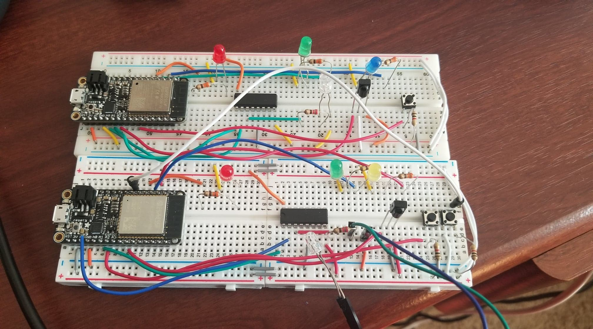

#  IR TX/RX

Author: Briana Zhao

Date: 2021-04-06
-----

## Summary

For this skill I built two identical 'fobs' with IR receivers and IR transmitters. Each fob can change the color of the LED being lit up by pressing a button, and when a second button is pressed on the fob, the same LED on the other fob will also be lit up. The information pertaining to which LED is lit is sent through the IR transmitter and received by the other fob's IR receiver. The colors of the LED cycle through 'Red', 'Green', 'Blue/Yellow', then 'OFF'.

## Sketches and Photos
Here is a photo of the fobs:

## Modules, Tools, Source Used Including Attribution

I modified the [provided traffic light example](https://github.com/BU-EC444/code-examples/tree/Spring-2021/traffic-light-ir-example)

## Supporting Artifacts

[Video to state/LED color on the first fob being changed by button click](https://drive.google.com/file/d/1U9_4igQHEDOeC5Iz2CU9elOecbadAYoi/view?usp=sharing)

[Video to state of first fob being sent via IR to second fob](https://drive.google.com/file/d/1UAqAtWt5WIe4E5rp56adU3p_fq1u9F63/view?usp=sharing)

[Link to my code](https://github.com/BU-EC444/Zhao-Briana/blob/master/skills/cluster-4/25/code/ir_txrx.c)

-----
