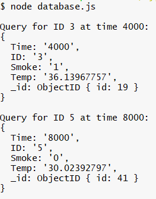

#  Persistence and Databases

Author: Briana Zhao

Date: 2021-04-06
-----

## Summary

For this skill I installed tingoDB and brought it up on my laptop. I then stored data from the smoke.txt file into a database. I also queried the database for specified information.

## Sketches and Photos

Here is a photo of the query result:

## Modules, Tools, Source Used Including Attribution

Source for learning how to use tingoDB:

https://github.com/sergeyksv/tingodb

## Supporting Artifacts

[Link to my code](https://github.com/BU-EC444/Zhao-Briana/blob/master/skills/cluster-4/26/code/database.js)

-----
