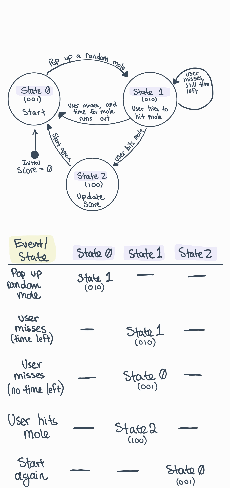

#  State Models

Author: Briana Zhao

Date: 2021-04-06
-----

## Summary

For this skill I represented the whack-a-mole game in a finite state machine (FSM) diagram and a state table. I then coded the FSM using the conditionals design pattern. The FSM has three states that the game switches between.

## Sketches and Photos

Here is a photo of my FSM diagram and state table:

## Modules, Tools, Source Used Including Attribution

[Class page for design patterns](http://whizzer.bu.edu/briefs/design-patterns/dp-state-machine)

## Supporting Artifacts

[Link to my code](https://github.com/BU-EC444/Zhao-Briana/blob/master/skills/cluster-4/27/code/whackamole.c)

-----
