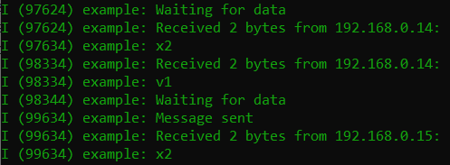

#  Leader Election

Author: Briana Zhao

Date: 2021-04-06
-----

## Summary

For this skill I implemented the bully algorithm between a set of fobs using a state machine. The states are 'leader', 'not leader', and 'election'. An election is started with a button press, and the fob with the highest ID is elected as the leader. When a fob becomes the leader, their second LED (the green LED) is lit up. I also used timeouts to limit the time a fob can be a leader. An election is held after the timeout if no fob chooses to start an election with a button press. A timeout is also used in case a fob is offline or doesn't respond during an election. The fobs communicate via UDP. Each fob has a UDP client, and each has multiple sockets to be able to transmit information to a UDP server.

## Sketches and Photos

Here is a photo of messages being transmitted via UDP:

## Modules, Tools, Source Used Including Attribution

[Provided ESP32 udp client example](https://github.com/espressif/esp-idf/tree/master/examples/protocols/sockets/udp_client)

[Provided ESP32 udp server example](https://github.com/espressif/esp-idf/tree/master/examples/protocols/sockets/udp_server)

## Supporting Artifacts

[Video to election being held and fob 2 being elected leader](https://drive.google.com/file/d/1a7gMOhpQba5O0xYpIrLWzO4OtC2_LRoO/view?usp=sharing)

[Video to election being held while fob 2 is offline, resulting in fob 1 being elected leader](https://drive.google.com/file/d/1a-j1PtFPRomUXDDnbDtiloq1edKSMlO-/view?usp=sharing)

[Link to my code](https://github.com/BU-EC444/Zhao-Briana/blob/master/skills/cluster-4/28/code/election.c)

-----
