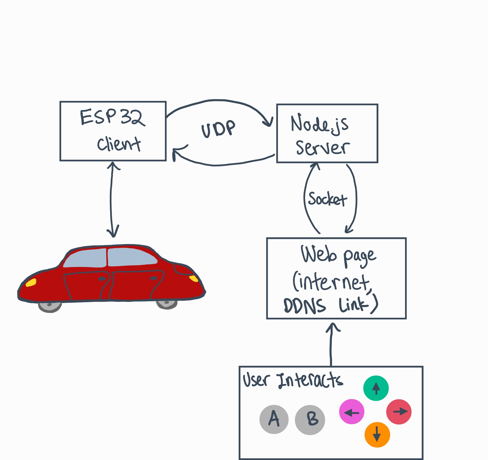

#  Security in Connected Systems

Author: Briana Zhao

Date: 2021-04-06
-----

## Summary

### Weaknesses in overall system
- Anyone who has internet and the link to the web page will be able to press the buttons and try to control the car. Total strangers can go to the site and send unwanted data to our local server.
- Many people can be on the web page at the same time and they might all be interacting with the controls on the page. Too much data would be sent simultaneously over socket/UDP and this could cause something to crash or lag.
- Someone might be able to access the code through our web page and be able to see our local IP address. They might try to change it to a different host IP address or try to steal other information.

### Ways a bad actor can attack the system
- The bad actor might be able to read packets being sent/messages being printed and be able to figure out the backend code. From here they could modify code or steal content, data, and ideas.
- The bad actor could intentionally press many of the controls (possibly by using many different devices to go to the web page) simultaneously to overload our system and force it to crash.
- The bad actor might navigate to the web page and change it so that the original controls (e.g. buttons for selecting direction) are modified and the car can no longer be correctly controlled. For example, they might remove all but one of the buttons so that one can only make the car move forward.
- Since the web page does not have a username and password login, the bad actor can navigate to the web page and set their own username and password, thus locking us and others out of the web page.
- Since our local IP address is hard coded in various places in our code, the bad actor could find it, figure out which internet service provider it's linked to, then find out potentially dangerous personal information. The bad guy could call the ISP, pretend to be an authorized law enforcement officer, and convince the ISP to divulge our personal information (e.g. our location).
- A bad actor might go to the web page and populate it with malware that can damage future devices that navigate to the web page. For example, they could edit a button click to download malware onto a device instead of allowing the button to control the car.

### Ways to mitigate security issues
- Require a username and password or 2 factor authentication to keep unwanted users out of the web page.
- Do not hard code IP addresses in so that a bad guy won't be able to find them and use them to steal personal information.
- Keep track of how many users are on the web page, and only allow a set number of them to control the car during any period of time. This will prevent the system from being overloaded and crashing.
- Use a service like Cloudfare to protect the web page from being accessed by strangers, manage the traffic of the web page, and block any potentially malicious activity. 

## Sketches and Photos

Here is a sketch of the flow of information for a car being controlled remotely over the internet:

## Modules, Tools, Source Used Including Attribution

## Supporting Artifacts

-----
