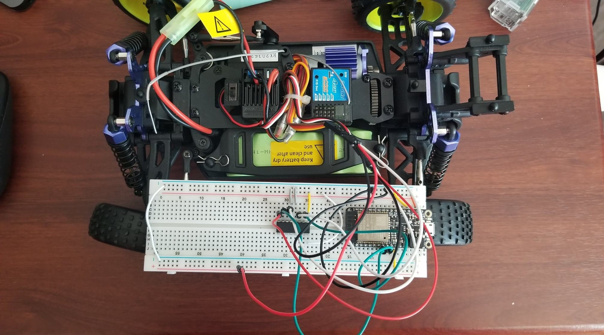

#  The Crawler - Prep

Author: Briana Zhao

Date: 2021-04-29
-----

## Summary

For this skill I wired up the buggy's ESC and steering servo and connected them to the ESP32. Then I wrote a program to angle the wheels from center to both left and right and back to center. The program also calibrates the ESC and cycles the speed from stopped to full forward and back to stopped.

## Sketches and Photos

Here is an image of the build:

## Modules, Tools, Source Used Including Attribution

## Supporting Artifacts

[Link to video](https://drive.google.com/file/d/1oxC4govQRhC-dPH_Sbkkr0kwct0hbAR8/view?usp=sharing)

[Link to my code](https://github.com/BU-EC444/Zhao-Briana/blob/master/skills/cluster-5/30/code/crawler.c)

-----
