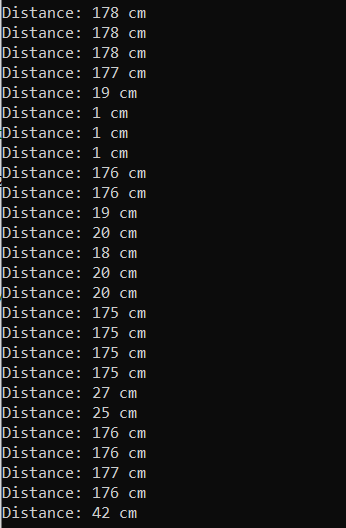
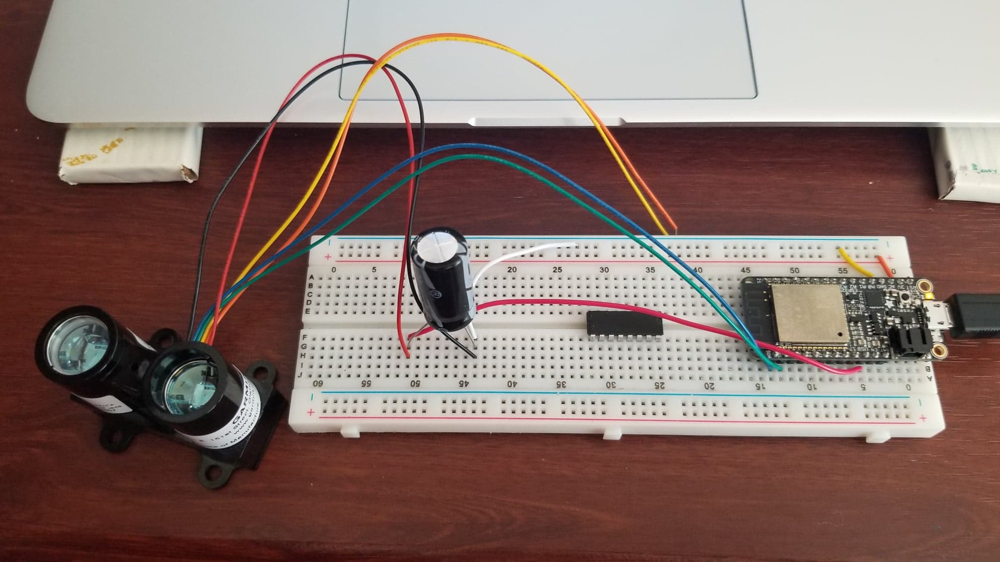

#  Bringing Up the LIDAR

Author: Briana Zhao

Date: 2021-04-29
-----

## Summary

For this skill, I connected my LIDAR v3 to my ESP32 and used it to measure distance. I used a 1000 microfarad capacitor and connected the LIDAR via I2C. From observing the performance of the LIDAR sensor, it would be a good sensor to use on the buggy. The distance measurements are mostly accurate, and the LIDAR is very responsive as the distance changes. Because of its accuracy and responsiveness, it would make a good distance sensor for the buggy.

## Sketches and Photos

Here is an image of the console:

Here is an image of the circuit:

## Modules, Tools, Source Used Including Attribution

[LIDAR-Lite V3 Datasheet](http://static.garmin.com/pumac/LIDAR_Lite_v3_Operation_Manual_and_Technical_Specifications.pdf)

## Supporting Artifacts

[Link to video](https://drive.google.com/file/d/1pGo97s9Aa4tf5w-H_7EisEyDBllq-xFm/view?usp=sharing)

[Link to my code](https://github.com/BU-EC444/Zhao-Briana/blob/master/skills/cluster-5/31/code/lidar.c)

-----
