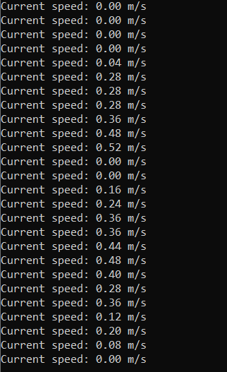
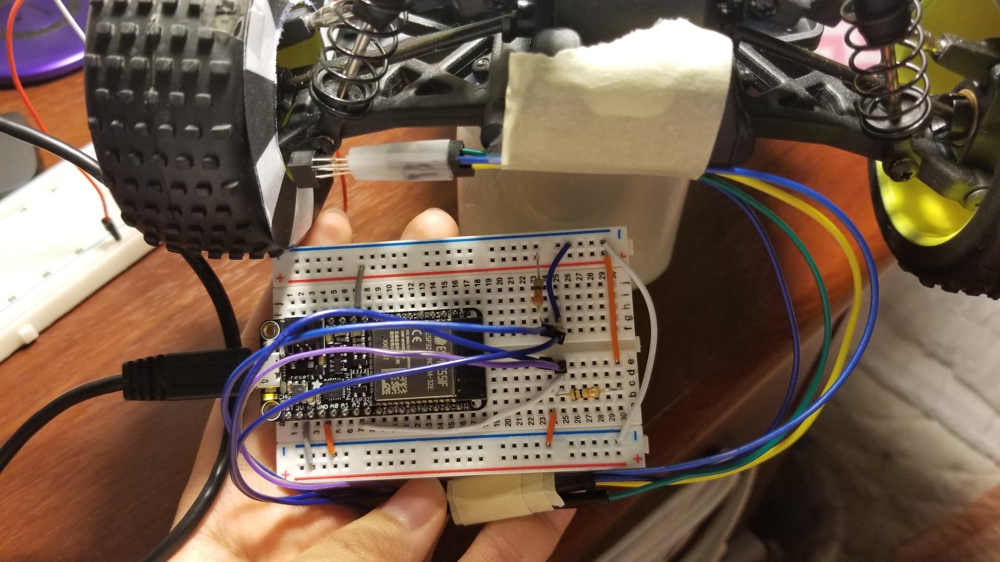

#  Wheel and Car Speed Sensor

Author: Briana Zhao

Date: 2021-04-29
-----

## Summary

For this skill I used an encoder to measure the speed of the car. I first printed out the encoder pattern and taped it to one of the back wheels. Then I wired up and positioned the encoder so that it would be able to detect the pattern on the wheel. In my program, I used a timer to count the number of pulses and calculate the speed.

## Sketches and Photos

Here is an image of the console:

Here is an image of the circuit:

## Modules, Tools, Source Used Including Attribution

https://learn.sparkfun.com/tutorials/qrd1114-optical-detector-hookup-guide#example-circuit

https://github.com/espressif/esp-idf/tree/17ac4bad7381e579e5a7775755cc25480da47d97/examples/peripherals/timer_group

https://github.com/espressif/esp-idf/tree/master/examples/peripherals/timer_group

https://www.esp32.com/viewtopic.php?t=5274

https://github.com/espressif/esp-idf/tree/master/examples/peripherals/pcnt/pulse_count_event

## Supporting Artifacts

[Link to video](https://drive.google.com/file/d/1pGrnoyMRJSaVL7-CWa-3LjsnqDMirYLN/view?usp=sharing)

[Link to my code](https://github.com/BU-EC444/Zhao-Briana/blob/master/skills/cluster-5/32/code/wheelspeed.c)

-----
