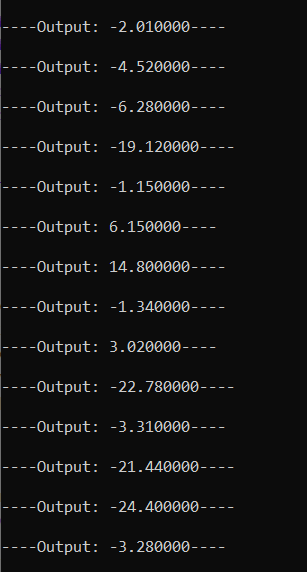
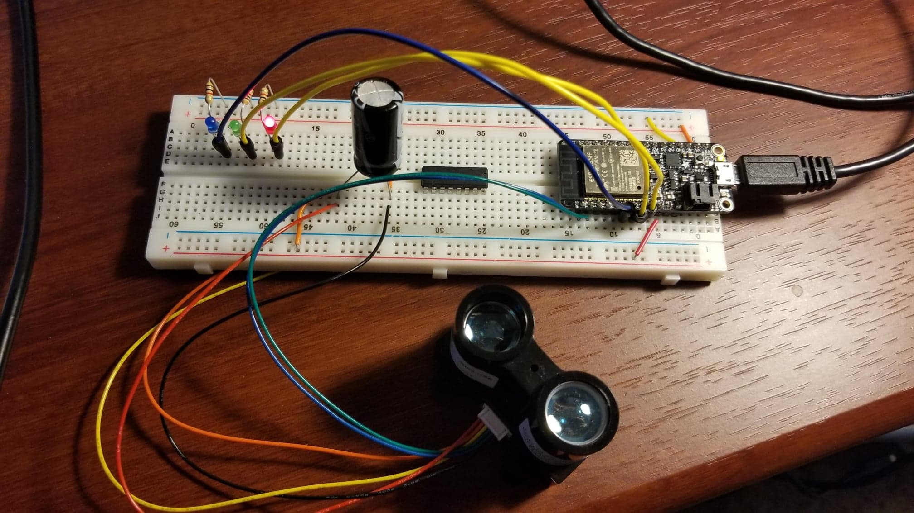

#  PID Control Using the Micro

Author: Briana Zhao

Date: 2021-04-29
-----

## Summary

For this skill I used the PID design pattern and implemented a timing loop (100ms) that calcuated the error for a setpoint each time. The program measures distance with the LIDAR v3 and it calculates the error from the setpoint, which is 50 cm. I used values of 1.25 for KP, 0.2 for KI, and 0.2 for KD. If the error is less than 0, then the red LED is turned on. If the error is greater than 0, then the blue LED is turned on. If the error is 0, then the green LED turns on.

## Sketches and Photos
Here is an image of the console:

Here is an image of the circuit:

## Modules, Tools, Source Used Including Attribution

http://whizzer.bu.edu/briefs/design-patterns/dp-pid

https://github.com/BU-EC444/code-examples/tree/master/timer-example

## Supporting Artifacts

[Link to video](https://drive.google.com/file/d/1pDj53E62QAxtCfRKrilIwvBr4G6-7UEl/view?usp=sharing)

[Link to my code](https://github.com/BU-EC444/Zhao-Briana/blob/master/skills/cluster-5/33/code/pid.c)

-----
